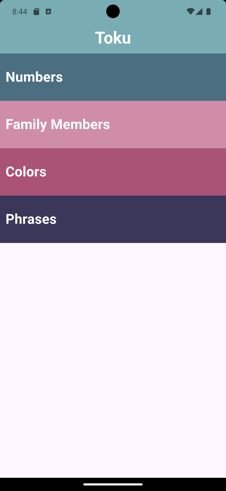
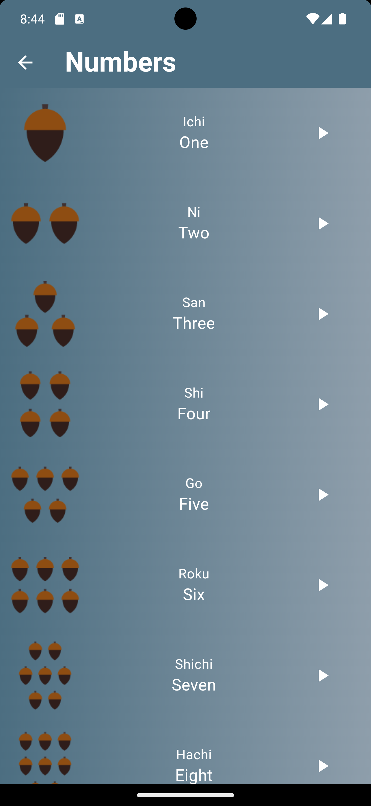
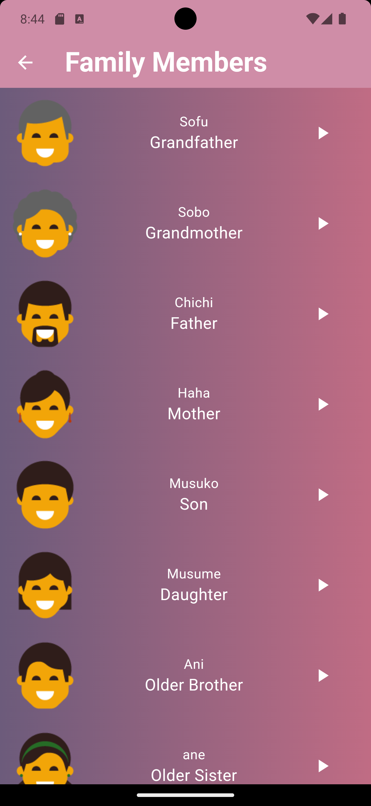
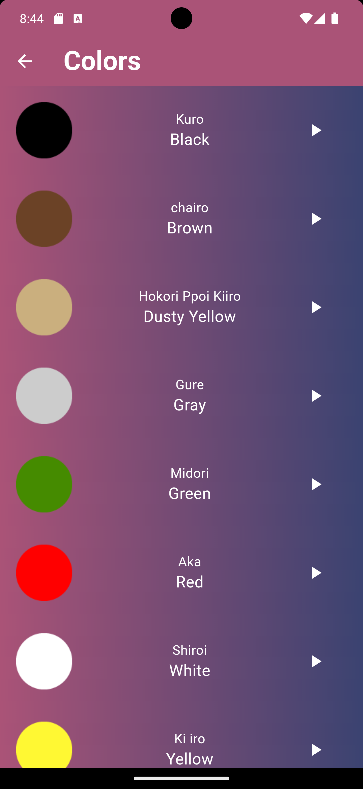
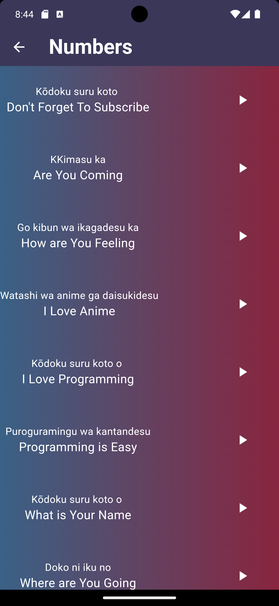

# Toku

Toku is a fun and interactive app built using Flutter to help users learn the Japanese language. The app includes several categories, each containing a set of items with images and audio pronunciations to enhance the learning experience.

## Features

- **Numbers**: Learn Japanese numbers with images and sounds.
- **Family Members**: Learn Japanese terms for family members.
- **Colors**: Discover the names of different colors in Japanese.
- **Phrases**: Learn common Japanese phrases.

## Screenshots

### Home Screen

The home screen displays the different categories available in the app.

### Numbers Screen

The Numbers screen shows Japanese numbers with images and audio pronunciation.

### Family Members Screen

The Family Members screen displays Japanese terms for family members with images and audio pronunciation.

### Colors Screen

The Colors screen shows the names of different colors in Japanese with images and audio pronunciation.

### Phrases Screen

The Phrases screen displays common Japanese phrases with audio pronunciation.

## Getting Started

To run a local copy of the app, follow these simple steps.

### Prerequisites

- Flutter SDK: [Install Flutter](https://flutter.dev/docs/get-started/install)
- An IDE like Android Studio or VS Code.

### Installation

1. Clone the repository
   ```sh
   git clone https://github.com/your_username/toku.git
